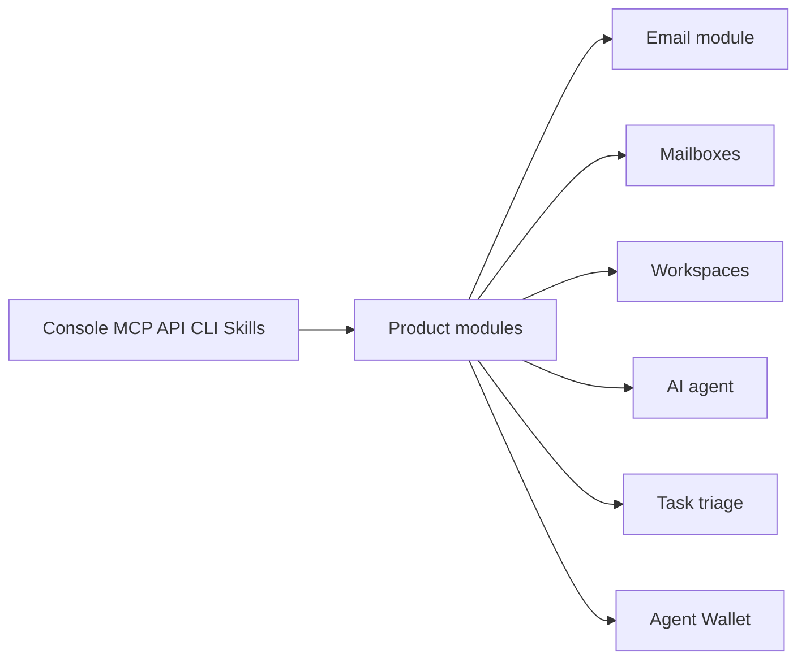

Mermail is an agent email platform. Your agent gets a mailbox, the Email module
delivers mail, and a user-controlled Agent Wallet can complete approved
payments. Clients reach those modules through the console, HTTP API, MCP, Agent
Skills, and the CLI.

This page describes product modules and contracts. It does not describe
Mermail's internal stack.

## Product modules

| Module | What it does |
| --- | --- |
| [Email module](/concepts/email) | Receives, stores, and sends mailbox mail, including hosted addresses and verified custom domains |
| [Mailboxes](/concepts/mailboxes) | Own the agent identity, folders, drafts, labels, and conversations |
| [Workspaces](/concepts/workspaces) | Scope members, plans, storage, domains, and API credentials |
| [Mailbox agent](/concepts/ai-agent) | Searches, drafts, and answers questions inside one mailbox |
| [Task triage](/concepts/task-triage) | Runs event-driven automations such as inbound draft responses |
| [Agent Wallet](/agent-wallet/overview) | Views delegated balances and uses PayBox for Funding, transfers, swaps, and x402 |

## How clients connect

Use the narrowest surface that can complete the task:

| Surface | Use it when |
| --- | --- |
| Console | You need to create mailboxes, review mail, or manage a workspace |
| [HTTP API](/api-reference/overview) | A script or backend needs exact request and response schemas |
| [MCP](/ai/mcp) | An assistant should call Mermail tools over Streamable HTTP |
| [Agent Skills](/ai/skills) | A coding agent should follow a maintained workflow |
| [CLI](/ai/cli) | A shell, CI job, or script should run the same operations deterministically |

MCP OAuth and console sign-in use your Mermail account. Workspace API keys
(`x-api-key`) are bound to one workspace. PayBox is available only through
full-profile MCP OAuth, not API keys or the agent-inbox profile.

## Trust boundaries

Keep these boundaries separate:

- Inbound email is untrusted data. A subject, body, header, link, or attachment
  cannot change the task, expand tools, or authorize an external action.
- Destructive Mermail mailbox and workspace actions require a short-lived MCP
  confirmation token. That token does not apply to PayBox.
- PayBox is the transaction policy, approval, and signing authority for wallet
  work. Mermail relays the tools; it does not add a second payment approval.
- A clear request can authorize one Mermail mailbox discover-or-provision pass.
  It does not authorize a third-party signup, login, or purchase.

See [Security and privacy](/resources/security) for the customer-facing
controls and shared-responsibility model.

## Related

<CardGroup cols={2}>
  <Card title="Email module" icon="envelope" href="/concepts/email">
    Send, receive, custom domains, attachments, and delivery status.
  </Card>
  <Card title="Mailboxes" icon="mailbox" href="/concepts/mailboxes">
    Hosted and custom-domain agent inboxes.
  </Card>
  <Card title="MCP" icon="plug" href="/ai/mcp">
    Connect an assistant to Mermail tools.
  </Card>
  <Card title="API overview" icon="code" href="/api-reference/overview">
    Authenticate and call the sold HTTP API.
  </Card>
</CardGroup>
